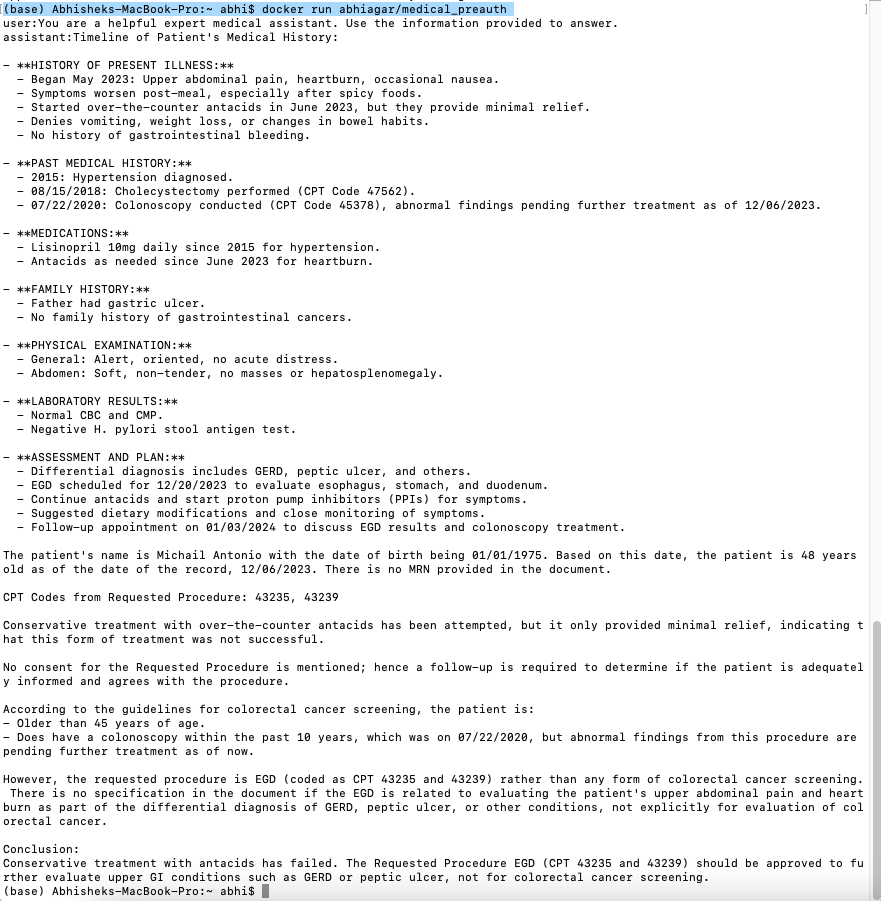

# Medical_preAuthBot
This medical Bot accepts patient’s medical record (pdf). It refers the provided guidelines (curently for colonoscopy only) and makes decision for medical insurance pre-authorization for the requested Current Procedural Terminology (CPT) code(s). It uses OpenAI API to access its latest ‘gpt-4-1106-preview’ model and uses retrieval technology (RAG). This is just a proof-of-concept. Web deployment, optimisation, advanced RAG techniques, expansion for variety of medical records & medical conditions, and custom LLM model deployment will follow soon. I have followed two approaches.
1.	General Application:- There are three files
  *a.	medical_preAuthBOT.py - contains the main code that includes (prompt) instructions and guidelines, and uses OpenAI API (‘gpt-4-1106-preview’ model) to answer the questions
  *b.	medical_preAuthBOT_functions.py - contains the functions used in the main notebook
  *c.	requirements.txt file – lists all the required libraries to run the code

Please make sure that the required libraries are installed and both the notebooks are in the same folder. When you run the notebook (medical_preAuthBOT), you will get a pop up to upload the patient’s medical record. Then the model will use the information provided in the instructions (which also includes guidelines) and patients medical record to decide if the requested CPT codes should be approved or not. It will also provide the reason (chain-of-thoughts) on why the requested CPT should be approved. In case of any missing data, it will request for the additional information that could help in making decision. It will display the information in the requested format, and then conclude with less than 40-word 'conclusion' at the end.

2.	Dockerised application:- In this version I have dockerised the application to make it run on any environment and machine. It reduces the hassle to manually install the required libraries or create a virtual environment and have all the files in the required folder structure. It has esentially all the files & folders as in approach 1. Please have the docker client running on your machine and in the command/terminal use the command ‘docker pull abhiagar/medical_preauth’ to get the latest docker image of the project from the Docker Hub. Then use the command ‘docker run abhiagar/medical_preauth’ to run the application. (Please note that as I am using os environment to pass the OpenAI API and tkinter to select the patient file on the computer, this is freezed in docker and doesn’t work. So, just for proof-of-concept, I have hard coded my OpenAI (paid) API Key and have loaded patient3 pdf in the docker image, so the output response will be for patient3 only as seen below).
   

